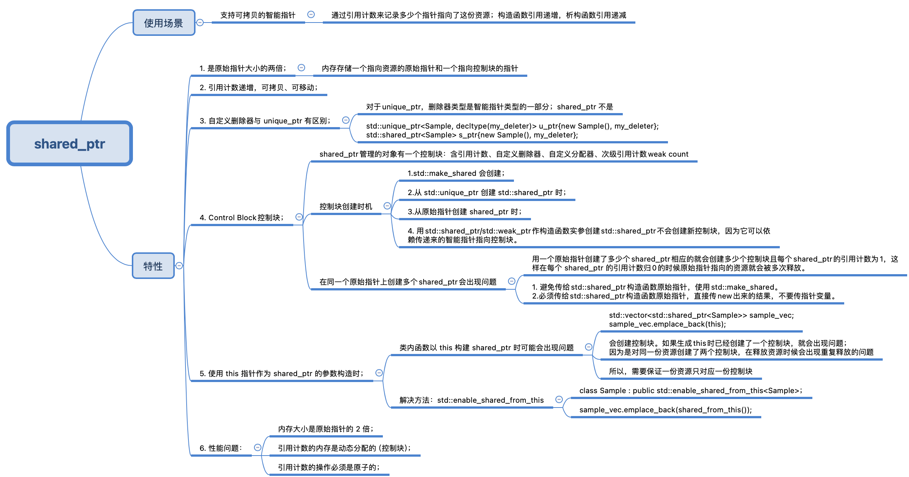

> "假期虽好，可别贪杯哦！今天开始，我们要一起努力，把2024年的每一天都过得像假期一样精彩！"

对于我这样的菜鸡，深受 C++ 内存管理的困扰，在工作中也犯下了很多错误。上次已经详细介绍了智能指针的原理和使用方法，今天会根据我经常使用的角度来总结一个较为简单的使用方法。当然，由于个人也还是 C++ 新手，有些不足可以一起探讨 :)。

## 1. 智能指针

C++ 的智能指针使用了 RAII 的概念（资源获取即初始化），通过使用对象的生命周期（构造和析构）来控制资源的获取和释放。这样的好处就是，让程序帮我们自动管理动态分配的内存，减少我们自己对原始指针的使用不规范导致内存斜口等问题。

其中，使用较多的智能指针包括：`unique_ptr`，`shared_ptr`，`weak_ptr`；推荐的智能指针创建方式是使用`make_unique/make_shared`。


## 2. `unique_ptr`

`unique_ptr` 的使用方式代表了对**资源的专有所有权**，该指针不可拷贝，只支持移动。

我在工作中常见的使用场景就是：某个对象如果期望是全局/局部唯一的，就会使用`unique_ptr`来创建。

```c++
std::unique_ptr<int> ptr(new int(42)); // 创建unique_ptr并初始化为指向新分配的内存 
```


## 3. `shared_ptr`

`shared_ptr` 对于我来说是比较常用的智能指针，使用上基本和普通指针一样。支持拷贝，支持移动。

`shared_ptr` 主要通过引用计数来控制资源的释放，当某份资源的引用计数归零（无`shared_ptr`指向这份资源），该资源就会被释放。

```c++
std::shared_ptr<int> ptr1 = std::make_shared<int>(42); // 使用make_shared创建shared_ptr  
std::shared_ptr<int> ptr2 = ptr1; // ptr1和ptr2现在共享同一个对象的所有权 
```



## 4. `weak_ptr`

`weak_ptr` 是通过`shared_ptr`创建得到的，不会增加资源的引用计数。主要是用来解决循环引用导致资源无法释放的问题。

```c++
std::shared_ptr<int> ptr1 = std::make_shared<int>(42);  
std::weak_ptr<int> wptr = ptr1; // wptr不控制对象的生命周期  
if (auto ptr2 = wptr.lock()) {}
```


## 5. `make_unique/make_shared`

`std::make_unique`是 C++14 引入的；`std::make_shared`是 C++11 引入的。再构建这两种指针时尽量使用这两种方式，具体的优势再截图中有展示。


## 6. 个人经验

从我个人角度来看，对新手来说，智能指针较优的使用姿势，如下：

1. 优先使用`std::make_unique`和`std::make_shared`来创建智能指针，以避免显式使用`new`操作符；  
2. 避免在函数间传递原始指针或裸指针，而是使用智能指针；  
3. 对资源有专有权的需求时使用`unique_ptr`，一般情况下都可以使用`shared_ptr`;  
4. 在可能形成循环引用的情况下，使用`std::weak_ptr`来打破循环。

遵循这些实践，我们这些新手也能够更好地利用智能指针，写出更加健壮和高效的C++代码了。
